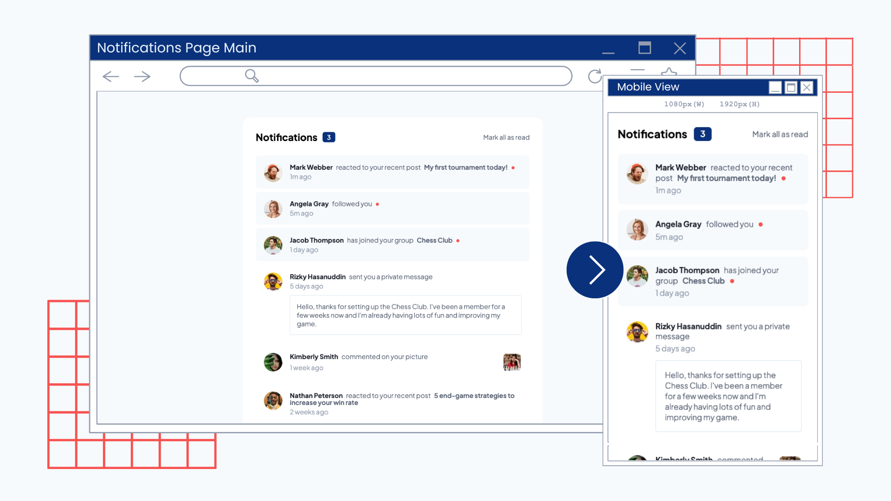

# Frontend Mentor - Notifications page solution

[](https://app.netlify.com/sites/notifications-page-erj/deploys)
   

This is the first time I use React and I thought this challenge is fitting for experimenting with useState.

This is a solution to the [Notifications page challenge on Frontend Mentor](https://www.frontendmentor.io/challenges/notifications-page-DqK5QAmKbC). Frontend Mentor challenges help you improve your coding skills by building realistic projects.

## Table of contents

- [Frontend Mentor - Notifications page solution](#frontend-mentor---notifications-page-solution)
  - [Table of contents](#table-of-contents)
  - [Overview](#overview)
    - [The challenge](#the-challenge)
    - [Screenshot](#screenshot)
    - [Links](#links)
  - [My process](#my-process)
    - [Built with](#built-with)
    - [What I learned](#what-i-learned)
    - [Continued development](#continued-development)
    - [Useful resources](#useful-resources)
  - [Author](#author)

## Overview

### The challenge

Users should be able to:

- Distinguish between "unread" and "read" notifications
- Select "Mark all as read" to toggle the visual state of the unread notifications and set the number of unread messages to zero
- View the optimal layout for the interface depending on their device's screen size
- See hover and focus states for all interactive elements on the page

### Screenshot



### Links

- Solution URL: [https://github.com/ereljapco/fem-notifications-page](https://github.com/ereljapco/fem-notifications-page)
- Live Site URL: [https://notifications-page-erj.netlify.app/](https://notifications-page-erj.netlify.app/)

## My process

### Built with

- Semantic HTML5 markup
- CSS custom properties
- Flexbox
- CSS Grid
- Mobile-first workflow
- [React](https://reactjs.org/) - JS library

### What I learned

- Using arrays for the data
  - Since I am using React for this challenge, I decided to make use of arrays for the data so I could use the array map method. The array for users is separate from the notifications since the users have two properties (name and avatar), and I just need the user (userId) to associate it with the notification.

```js
const userLists = [
  {
    id: 1,
    name: 'Mark Webber',
    img: avatarImgs.user1,
    url: '#',
  },
  // more users
];
```

```js
const notificationsList = [
  {
    id: 1,
    isRead: '',
    userId: 1,
    notificationMsg: 'reacted to your recent post',
    itemTitle: 'My first tournament today!',
    itemLink: '#',
    itemImg: '',
    itemMsg: '',
    timeStamp: '1m',
  },
  // more notifications
];
```

- Updating the useState variable on a different component by passing its function as prop
  - I'm not sure if this is the most efficient way to do it, but I tried solving it myself first, and fortunately, it works!
  - I also passed on the `notificationsList` as a prop. But in the `Notifications` component, I use `import`. Both works, but I still yet to find out which works better for this scenario.

```js
export default function App() {
  const [read, setRead] = useState(notificationsList);

  return (
    <main className="main">
      <section className="notifications">
        <div className="c-notifications">
          <Header setRead={setRead} notificationsList={notificationsList} />
          <Notifications />
        </div>
      </section>
    </main>
  );
}
```

- Using the array filter method to set the initial state of the number of unread notifications

```js
const unread = notificationsList.filter(
  (notification) => notification.isRead === ''
);
const [unreadCount, setUnreadCount] = useState(unread.length);
```

### Continued development

I hope to find more scenarios where I can utilize the use of `useState`. Maybe I'll build where I can work with it along side a database.

### Useful resources

- [React Tutorial by John Smilga](https://www.udemy.com/course/react-tutorial-and-projects-course/?referralCode=FEE6A921AF07E2563CEF) - His courses really helped me understand concepts and how to apply them on projects.

## Author

- Github - [/ereljapco](https://github.com/ereljapco/)
- Frontend Mentor - [@ereljapco](https://www.frontendmentor.io/profile/ereljapco)
